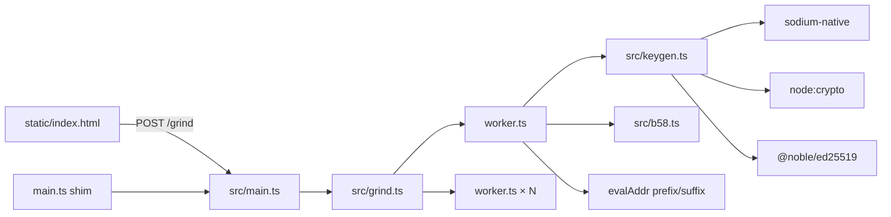

# Solden — Solana vanity address grinder

High-throughput **Ed25519** vanity grinding for Solana with a **web control panel**, **NDJSON/SSE streaming**, **multi-backend batch keygen**, and a **zero-runtime-dep** CLI. Ships for **Deno**, **Bun**, and **Node ≥ 22**.

[](deno.json)
[](package.json)
[](package.json)

---

## Features

- **Index-scoped matching** — only compares prefix `addr[0..n)` and suffix `addr[len-m..len)`; middle bytes never scored.
- **Pluggable keygen** — `auto` → `sodium-native` → `node:crypto` → `@noble/ed25519` → Web Crypto `subtle`, with **batched** worker loops (`VANITY_KEYGEN_BATCH`).
- **Parallel workers** — `worker_threads` / Web Workers; configurable caps and Bun oversubscribe.
- **HTTP API** — `POST /grind` JSON or **NDJSON** stream; SSE `/events` for live progress.
- **Web UI** — [`static/index.html`](static/index.html) with **Advanced mode** for every `GrindOpts` field.
- **Admin** — background jobs, monitor, unthrottled mode ([`static/admin.html`](static/admin.html); 4× tap logo on main UI).
- **Optional AES-256-GCM** encryption of exported secrets.
- **Deploy-aware** — Deno Deploy caps, ephemeral hits by default, optional KV persist.

---

## Architecture



---

## Quick start

### Deno (recommended for dev)

```bash
deno task server
# → http://127.0.0.1:3737/
```

### Max local throughput (optional native deps)

```bash
npm i sodium-native @noble/ed25519 @noble/hashes
deno task grind-turbo -- -p XXXX -n 1
# or: npm run bun-turbo -- -p XXXX
```

### One-shot CLI

```bash
deno task grind -- -p meth -s ic -n 1 -t 8 -K auto -G 64 -g 8192
```

---

## CLI flags

| Flag | Alias | Type | Default | Description |
|------|-------|------|---------|-------------|
| `--prefix` | `-p` | string | `""` | Base58 prefix (start of address) |
| `--suffix` | `-s` | string | `""` | Base58 suffix (end of address) |
| `--count` | `-n` | int | `1` | Exact hits to find before stop |
| `--threads` | `-t` | int | CPU count | Worker threads to spawn |
| `--max-workers` | `-m` | int | `256` | Hard cap on effective workers |
| `--bun-oversubscribe` | `-B` | float | `1` | Multiply workers (**Bun only**) |
| `--progress-every` | `-g` | int | `512` | Worker iterations between progress msgs |
| `--ui-refresh-ms` | `-u` | int | `5000` | CLI redraw interval (ms) |
| `--threshold` | `-r` | 0–100 | `90` | Stream/write partial matches ≥ % |
| `--case-sensitive` | `-c` | flag | off | Case-sensitive prefix/suffix |
| `--encrypt` | `-e` | flag | off | AES-256-GCM wrap secret in results |
| `--decrypt-key` | `-k` | string | `""` | Passphrase or 64-hex AES key; blank = auto |
| `--keygen` | `-K` | enum | `auto` | `auto\|sodium\|noble\|node\|subtle` |
| `--keygen-batch` | `-G` | int | `64` | Keys per worker batch (8–256) |
| `--use-webgpu` | `-W` | flag | off | Probe WebGPU (Deno local; CPU grind) |
| `--output` | `-o` | path | `hits.jsonl` | CLI hit log |
| `--bin-jsonl` | `-f` | path | `bin.jsonl` | Scores 70–80% log |
| `--db-path` | `-d` | path | `vanity.db` | SQLite / KV path |
| `--server` | `-S` | flag | — | HTTP server mode |
| `--port` | `-P` | int | `3737` | Listen port (`PORT` env overrides) |
| `--verbose` | `-v` | flag | — | Debug logs |
| `--help` | `-h` | flag | — | Full help text |

Run `deno run --allow-read --allow-write --allow-net --allow-sys main.ts --help` for the embedded help banner.

---

## `POST /grind` body (`GrindOpts`)

All fields accepted by the server (UI **Advanced mode** sends the full set):

| Field | Type | Default | Notes |
|-------|------|---------|-------|
| `prefix` | string | `""` | |
| `suffix` | string | `""` | |
| `count` | number | `1` | Max `1_000_000` |
| `threads` | number | `cpuCount` | Max `512` |
| `maxWorkers` | number | `256` | Max `1024` |
| `threadsMultiplier` | number | `1` | Alias of `bunOversubscribe` in HTTP parser |
| `bunOversubscribe` | number | `1` | Same multiplier (≥ `0.1`) |
| `progressEvery` | number | `512` | 64 … 10_000_000 |
| `uiRefreshMs` | number | `100` | Server throttle for HTTP progress |
| `threshold` | number | `90` | 0 … 100 |
| `caseSensitive` | boolean | `false` | |
| `encrypt` | boolean | `false` | |
| `decryptKey` | string | `""` | Used when `encrypt: true` |
| `useWebgpu` | boolean | `false` | Unless `VANITY_USE_WEBGPU` env set |
| `keygen` | string | `auto` | Unless `VANITY_KEYGEN` env set |
| `keygenBatch` | number | `64` | Unless `VANITY_KEYGEN_BATCH` env set |

**Streaming:** send `Accept: application/x-ndjson` for line-delimited `progress`, `threshold`, `done` events.

**Response header:** `x-grind-wall-ms` on JSON completion.

---

## Environment variables

| Variable | Purpose |
|----------|---------|
| `PORT` | HTTP port (default `3737`) |
| `SERVER_MODE` | `server` forces HTTP mode |
| `LOG_LEVEL` | `trace` … `error` |
| `LOG_JSON` | `1` — JSON logs on stderr |
| `LOG_VERBOSE` | Richer TTY pulse logs |
| `ACCESS_CONTROL_ALLOW_ORIGIN` | CORS for cross-origin UI |
| `VANITY_KEYGEN` | `auto\|sodium\|noble\|node\|subtle` (overrides body/CLI when set) |
| `VANITY_KEYGEN_BATCH` | Worker batch size 8–256 |
| `VANITY_USE_WEBGPU` | `0\|1\|auto` — WebGPU probe policy |
| `VANITY_HTTP_EPHEMERAL` | `1` — no DB/KV persist for HTTP hits |
| `VANITY_HTTP_PERSIST_HITS` | `1` — on Deploy, store hits in KV |
| `VANITY_SSE_LOG_PULSE` | `1` — mirror grind pulses to SSE on Deploy |
| `VANITY_DEPLOY_MAX_WORKERS` | Per-isolate worker cap |
| `VANITY_DEPLOY_MEMORY_BUDGET_MB` | Heuristic cap from memory budget |
| `VANITY_DEPLOY_MB_PER_WORKER` | MB assumed per worker (default `48`) |
| `VANITY_ADMIN_PASSWORD` | Enables [`/admin.html`](static/admin.html) API |

See [`.env.example`](.env.example).

---

## HTTP routes

| Method | Path | Description |
|--------|------|-------------|
| `GET` | `/` | Control panel |
| `GET` | `/admin.html` | Admin UI (password via API) |
| `GET` | `/health` | Liveness |
| `GET` | `/system` | CPU, runtime, Deploy caps, recommendations |
| `GET` | `/events` | SSE: logs + progress |
| `GET` | `/results` | Last DB hits (empty if ephemeral HTTP) |
| `POST` | `/grind` | Start grind (`GrindOpts` JSON) |
| `POST` | `/admin/api/login` | Admin token |
| `GET` | `/admin/api/jobs` | List background jobs |
| `POST` | `/admin/api/jobs` | Start background job |
| `GET` | `/admin/api/monitor` | Resource snapshot |

---

## Deno tasks

| Task | Command |
|------|---------|
| `server` | Watch + HTTP UI |
| `grind` | CLI pass-through (`--` then flags) |
| `grind-fast` | Higher `-g`, `-B`, `-K auto` |
| `grind-turbo` | `-m 64 -B 1.5 -g 16384 -K auto -G 64 -r 100` |
| `grind-gpu` | `--unstable-webgpu` + `-W` |
| `bench-keygen` | Backend throughput benches |
| `check` | Typecheck all modules |
| `deploy` | `deno deploy .` |

---

## Performance notes

| Backend | Typical per-thread (batch 64 + b58) | Notes |
|---------|-------------------------------------|-------|
| `node` | ~12–20k keys/s | Best default on Deno with Node compat |
| `sodium` | ~25–50k keys/s | Needs `npm i sodium-native` + build chain |
| `noble` | ~3–8k keys/s | Pure JS; requires SHA-512 hook (configured in-repo) |
| `subtle` | ~3–4k keys/s | Fallback when no faster backend loads |

**Aggregate throughput** ≈ `per_thread × effective_workers`. Example: 16 workers × 12k ≈ **192k keys/s**. **500k keys/s** needs a many-core host, `sodium` or heavy oversubscribe, and high `-g` (less IPC).

```bash
deno task bench-keygen
```

---

## Repository layout

| Path | Role |
|------|------|
| [`main.ts`](main.ts) | Entry shim → [`src/main.ts`](src/main.ts) |
| [`src/worker.ts`](src/worker.ts) | Batch grind loop + vanity match |
| [`src/keygen.ts`](src/keygen.ts) | Backend selection + `fillBatch` |
| [`src/b58.ts`](src/b58.ts) | Hot base58 encoder |
| [`src/grind.ts`](src/grind.ts) | Worker pool orchestration |
| [`src/db.ts`](src/db.ts) | SQLite / KV / ephemeral |
| [`src/admin.ts`](src/admin.ts) | Admin jobs + auth |
| [`static/index.html`](static/index.html) | Public UI + Advanced mode |
| [`benchmarks/`](benchmarks/) | `deno bench` suites |

---

## Web UI — Advanced mode

Toggle **Advanced mode** on the grind form to edit:

- Keygen backend + batch size  
- Worker multiplier (`threadsMultiplier` / Bun `-B`)  
- `progressEvery`, `uiRefreshMs`, `maxWorkers`  
- WebGPU probe, decrypt passphrase  

Preference is stored in `localStorage` (`solden_advanced_mode`). Progress cards show live `keygenBackend` when workers report it.

---

## Decrypt

```bash
deno task decrypt
# ciphertext hex + key hex → stdout secret (base58)
```

---

## Development

Dated work log: [`DEVELOPMENT.md`](DEVELOPMENT.md).

```bash
deno task check
deno task server-ui
```

---

## Author

David Pere — [davidpere.vercel.app](https://davidpere.vercel.app) · [@davidpereishim](https://x.com/davidpereishim) · [github.com/David-glitc/solden](https://github.com/David-glitc/solden)
